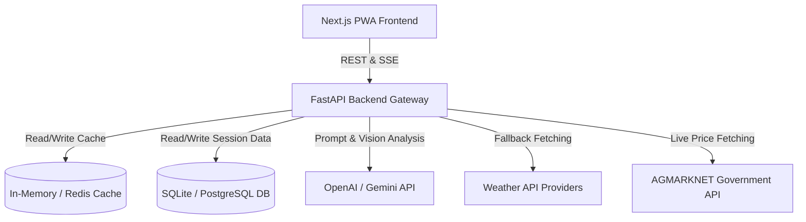

# System Architecture

This document details the high-level system architecture and component interactions of the KisaanBuddy platform.

---

## System Overview

KisaanBuddy follows a decoupled, stateless **client-server architecture**. The frontend is a Next.js PWA client-side web application, while the backend is an asynchronous FastAPI REST server. 

---

## Architectural Principles

1. **Stateless Backend Nodes:** The FastAPI server maintains zero instance-specific state. All user sessions, chat histories, and cache stores are externalized to databases (SQLite/PostgreSQL) and Redis. This makes horizontal autoscaling trivial.
2. **Resilience to Network Latency:** Rural mobile connectivity is notoriously unstable. KisaanBuddy implements defensive client-side request caching, debounced inputs, and lightweight text payloads. The chatbot uses Server-Sent Events (SSE) so users see tokens immediately instead of waiting for full API responses.
3. **Graceful Failbacks:** If third-party APIs (like OpenWeatherMap or OpenAI) are unreachable, the system automatically falls back to secondary weather providers or local mock heuristic algorithms so the app remains partially functional.
